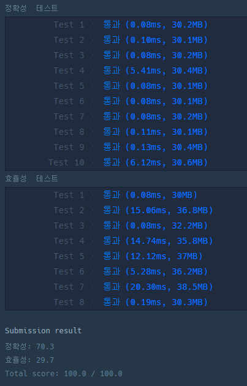
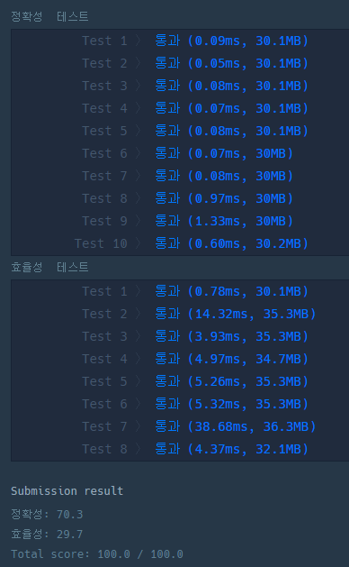

# 알고리즘 문제 해설

- 강의 : [프로그래머스](https://programmers.co.kr/learn/courses/18)

## 1. 각 자릿수의 합 구하기

- 예제

  - 예제 1 : 주어진 숫자는 123
    - 주어진 숫자가 123이면 각 자릿수 1,2,3을 더한 결과는 6입니다.

- 풀이

  - 자연수 N의 각 자리의 숫자를 구해야 합니다.

    - 자연수 N의 1의 자리를 구하려면? 10으로 나눈 나머지를 구하면 된다.

      > 123%10=3

    - 10의 자리를 구하기 위해서는?

      1. 필요 없어진 1의 자리를 제거한다.

      2. 1의 자리를 제거하기 위해서 10으로 나눈 몫을 계산한다.

         > 123%10 = 3
         >
         > 123/10 = 12

- 정리

  1. 1의 자리를 구한다.
  2. 1의 자리를 제거하고 나머지 숫자들을 오른쪽으로 한 칸씩 이동시킨다.
  3. 더 이상 이동시킬 숫자가 없을때까지 반복한다.

## 2. 순열 검사

- 예제1

  - 배열의 길이 n=4
  - 1~4의 숫자가 들어있는지 확인

- 방법

  1. 첫 번째 인덱스부터 마지막 인덱스까지 순회하면서 다음을 수행해 본다.

     1. 범위를 벗어나는 값이 있는지 확인

     2. 범위를 벗어나지 않는 값이 몇 번 등장하는지 확인

        ```javascript
        function solution(arr) {
          let answer = true;
          const length = arr.length;
          const check_arr = [];

          for (let i = 0; i < length; i++) {
            if (arr[i] < 1 || length < arr[i]) {
              return false;
            }
            if (check_arr[arr[i] - 1] === undefined) {
              check_arr[arr[i] - 1] = 1;
            } else {
              return false;
            }
          }

          return answer;
        }
        ```

        

  2. 정렬로 풀기

     1. 먼저 배열을 정렬

     2. 정렬된 배열을 순서대로 순회하면서 1부터 n까지의 숫자가 모두 있는지 확인

        ```javascript
        function solution(arr) {
          let answer = true;
          arr.sort((a, b) => a - b);
          for (let i = 0; i < arr.length; i++) {
            if (arr[i] !== i + 1) {
              answer = false;
              return answer;
            }
          }
          return answer;
        }
        ```

        

## 3. 나머지 한 점

## 4. 가장 큰 정사각형 찾기

## 5. 땅따먹기

## 6. 스티커 모으기

## 7. 단어 퍼즐
